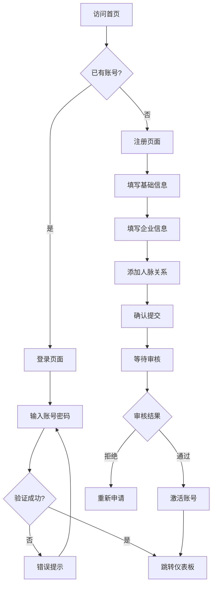
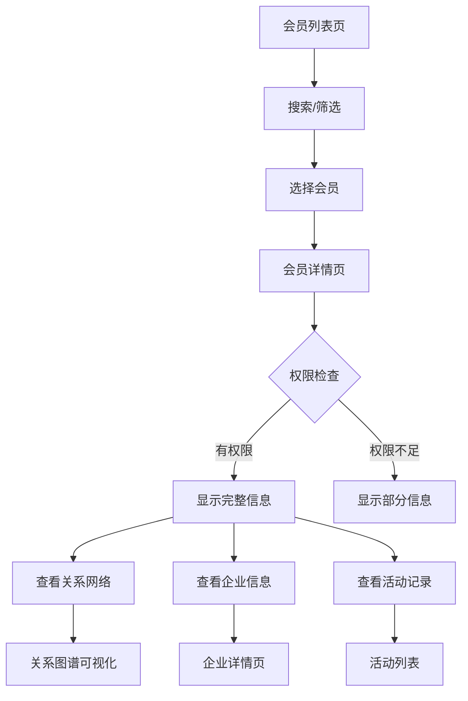
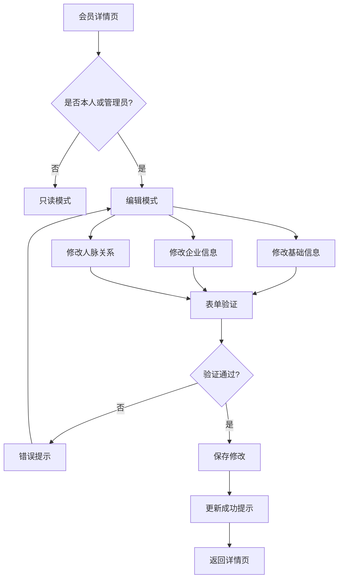
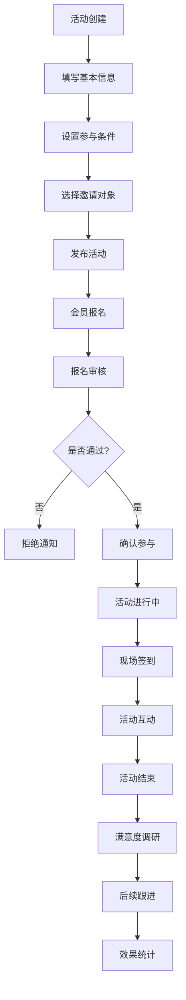
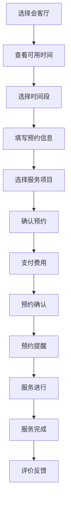
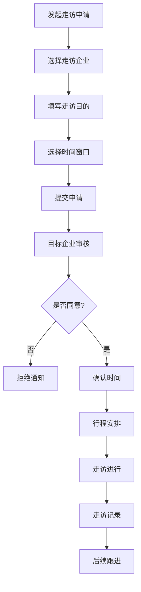
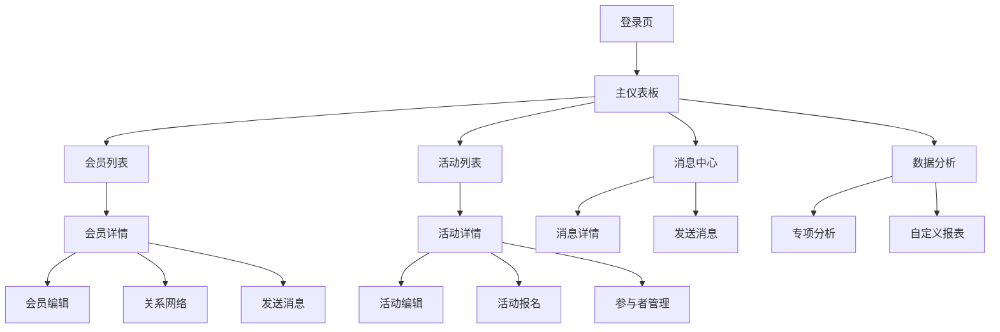

# 预企汇平台前端页面和业务流程设计文档

## 文档概述
本文档详细分析了企业联盟平台的所有前端页面结构、业务流程和页面间的跳转关系，为前端开发提供完整的页面架构指导。

**创建时间**: 2025-08-10  
**文档版本**: v1.0  
**目标受众**: 前端开发工程师、产品经理、UI/UX设计师  
**关联文档**: [项目开发设计文档](./项目开发设计文档.md) | [前端交互设计文档](./前端交互设计文档.md)

---

## 🗂️ 整体页面架构

### 1. 页面层级结构

```
预企汇平台
├── 🏠 公共页面
│   ├── 登录页面 (/login)
│   ├── 注册页面 (/register)
│   ├── 忘记密码 (/forgot-password)
│   └── 404页面 (/404)
│
├── 📊 仪表板区域
│   ├── 主仪表板 (/dashboard)
│   ├── 个人工作台 (/workspace)
│   └── 快捷操作面板 (/quick-actions)
│
├── 👥 会员管理
│   ├── 会员列表 (/members)
│   ├── 会员详情 (/members/:id)
│   ├── 会员档案编辑 (/members/:id/edit)
│   ├── 人脉关系图 (/members/:id/network)
│   ├── 会员注册审核 (/members/approval)
│   └── 会员等级管理 (/members/levels)
│
├── 🏢 企业信息
│   ├── 企业列表 (/companies)
│   ├── 企业详情 (/companies/:id)
│   ├── 企业档案编辑 (/companies/:id/edit)
│   ├── 企业宣传页 (/companies/:id/showcase)
│   └── 企业案例管理 (/companies/:id/cases)
│
├── 📅 活动管理
│   ├── 活动列表 (/activities)
│   ├── 活动详情 (/activities/:id)
│   ├── 活动创建/编辑 (/activities/create, /activities/:id/edit)
│   ├── 活动报名 (/activities/:id/register)
│   ├── 活动签到 (/activities/:id/checkin)
│   ├── 资源对接会 (/activities/matching)
│   ├── 私董会 (/activities/boardroom)
│   ├── 企业会客厅 (/activities/reception)
│   └── 企业走访 (/activities/visits)
│
├── 💬 消息中心
│   ├── 消息列表 (/messages)
│   ├── 消息详情 (/messages/:id)
│   ├── 发送消息 (/messages/compose)
│   └── 通知设置 (/messages/settings)
│
├── 📋 预约管理
│   ├── 预约列表 (/reservations)
│   ├── 创建预约 (/reservations/create)
│   ├── 预约详情 (/reservations/:id)
│   ├── 会客厅预约 (/reservations/reception)
│   └── 日程管理 (/reservations/calendar)
│
├── 📄 内容管理
│   ├── 内容列表 (/content)
│   ├── 内容编辑器 (/content/editor)
│   ├── 媒体库 (/content/media)
│   ├── 专访视频 (/content/interviews)
│   └── 新闻资讯 (/content/news)
│
├── 📈 数据分析
│   ├── 综合报表 (/analytics)
│   ├── 会员分析 (/analytics/members)
│   ├── 活动统计 (/analytics/activities)
│   ├── 财务报表 (/analytics/finance)
│   └── 自定义报表 (/analytics/custom)
│
├── ⚙️ 系统设置
│   ├── 个人设置 (/settings/profile)
│   ├── 账户安全 (/settings/security)
│   ├── 通知偏好 (/settings/notifications)
│   ├── 隐私设置 (/settings/privacy)
│   ├── 系统配置 (/settings/system) [管理员]
│   └── 权限管理 (/settings/permissions) [管理员]
│
└── 📱 移动端特色
    ├── 移动仪表板 (/mobile/dashboard)
    ├── 扫码签到 (/mobile/qr-checkin)
    ├── 快捷联系 (/mobile/quick-contact)
    └── 现场互动 (/mobile/onsite)
```

### 2. 页面分类统计

| 分类 | 页面数量 | 主要功能 |
|------|---------|----------|
| 基础页面 | 4 | 登录认证、错误处理 |
| 仪表板 | 3 | 数据概览、快捷操作 |
| 会员管理 | 6 | 会员档案、关系网络 |
| 企业信息 | 5 | 企业档案、案例展示 |
| 活动管理 | 9 | 活动全生命周期管理 |
| 消息通知 | 4 | 站内消息、通知推送 |
| 预约系统 | 5 | 预约服务、日程管理 |
| 内容管理 | 5 | 多媒体内容、新闻资讯 |
| 数据分析 | 5 | 业务报表、数据可视化 |
| 系统设置 | 6 | 个人设置、系统管理 |
| 移动端 | 4 | 移动端特色功能 |
| **总计** | **56** | **完整业务覆盖** |

---

## 🔄 核心业务流程设计

### 1. 用户注册与认证流程

#### 流程图


#### 详细步骤

**第一步：基础信息填写** (`/register?step=1`)
```typescript
interface BasicInfo {
  name: string;           // 姓名
  phone: string;          // 手机号
  email: string;          // 邮箱
  idCard: string;         // 身份证号
  birthDate: Date;        // 出生日期
  gender: 'male' | 'female'; // 性别
  location: string;       // 籍贯
  maritalStatus: 'single' | 'married' | 'divorced'; // 婚姻状态
  education: string;      // 学历
  avatar?: File;          // 头像上传
}
```

**第二步：企业信息填写** (`/register?step=2`)
```typescript
interface CompanyInfo {
  companyName: string;     // 公司名称
  companyAddress: string;  // 公司地址
  industry: string;        // 所属行业
  position: string;        // 职位
  companyScale: string;    // 公司规模
  businessScope: string[]; // 业务范围
  establishDate: Date;     // 成立时间
  registeredCapital: number; // 注册资本
  companyDescription: string; // 公司介绍
  businessLicense?: File;  // 营业执照
  cases: CaseInfo[];       // 过往案例
}
```

**第三步：人脉关系添加** (`/register?step=3`)
```typescript
interface NetworkInfo {
  familyContacts: Contact[];      // 亲属重要关系
  businessContacts: Contact[];    // 业务重要关系
  politicalContacts: Contact[];   // 政商重要关系
  wealthyContacts: Contact[];     // 高净值人群关系
  referrer?: string;              // 推荐人
  references: Reference[];        // 推荐信息
}

interface Contact {
  name: string;
  position: string;
  company: string;
  relationship: string;
  phone?: string;
  verified: boolean;
}
```

**第四步：确认提交** (`/register?step=4`)
- 信息预览确认
- 服务协议同意
- 隐私政策确认
- 提交审核

### 2. 会员档案管理流程

#### 档案查看流程


#### 档案编辑流程


### 3. 活动全生命周期流程

#### 活动创建到完成流程


#### 活动类型特殊流程

**资源对接会流程** (`/activities/matching`)
```typescript
interface MatchingEvent {
  type: 'industry' | 'career' | 'thematic';
  targetIndustry?: string[];
  careerLevel?: string[];
  theme?: string;
  matchingRules: MatchingRule[];
  expectedConnections: number;
  successMetrics: string[];
}

// 对接流程
const matchingFlow = [
  '需求收集', '智能匹配', '预匹配推荐', 
  '确认对接', '现场介绍', '后续跟进'
];
```

**私董会流程** (`/activities/boardroom`)
```typescript
interface BoardroomEvent {
  type: 'industry_focused' | 'custom' | 'dining';
  industryFocus?: string;
  maxParticipants: number;
  confidentialityLevel: 'high' | 'medium';
  agenda: AgendaItem[];
  facilitator: string;
  venue: VenueInfo;
}

// 私董会流程
const boardroomFlow = [
  '主题确定', '成员邀请', '保密协议', 
  '预备会议', '正式会议', '会议纪要', '后续执行'
];
```

### 4. 预约系统业务流程

#### 会客厅预约流程


#### 企业走访预约流程


---

## 📄 详细页面设计规范

### 1. 主仪表板页面 (`/dashboard`)

#### 页面布局
```typescript
interface DashboardLayout {
  header: {
    logo: React.Component;
    userMenu: UserMenu;
    notifications: NotificationBell;
    search: GlobalSearch;
  };
  sidebar: {
    navigation: MainNavigation;
    quickActions: QuickActionPanel;
    userProfile: UserProfileCard;
  };
  main: {
    widgets: DashboardWidget[];
    layout: 'grid' | 'list';
    customizable: boolean;
  };
}
```

#### 核心组件
**统计卡片组件**
```typescript
const StatCard = ({ title, value, trend, icon, onClick }: StatCardProps) => (
  <div className="bg-white rounded-lg p-6 shadow-sm border cursor-pointer" onClick={onClick}>
    <div className="flex items-center justify-between">
      <div>
        <p className="text-sm font-medium text-gray-600">{title}</p>
        <p className="text-2xl font-bold text-gray-900 mt-2">{value}</p>
        <div className="flex items-center mt-2">
          <TrendIcon trend={trend} />
          <span className={`text-sm ml-1 ${getTrendColor(trend)}`}>
            {trend} 较上月
          </span>
        </div>
      </div>
      <div className="p-3 bg-blue-50 rounded-full">
        {icon}
      </div>
    </div>
  </div>
);
```

**仪表板小组件**
- **今日概览**: 今日活动、新增会员、待处理事项
- **活动日历**: 近期活动时间轴展示
- **会员动态**: 最新加入会员、活跃会员排行
- **消息中心**: 未读消息数量、重要通知
- **快捷操作**: 创建活动、发送消息、添加会员
- **数据趋势**: 会员增长趋势、活动参与度趋势

### 2. 会员列表页面 (`/members`)

#### 页面功能结构
```typescript
interface MemberListPage {
  filters: {
    searchBox: SearchInput;
    industryFilter: MultiSelect;
    locationFilter: MultiSelect;
    memberLevelFilter: Select;
    joinDateRange: DateRangePicker;
    sortOptions: SortSelect;
  };
  display: {
    viewMode: 'grid' | 'list' | 'table';
    pagination: Pagination;
    exportButton: ExportButton;
    batchActions: BatchActionBar;
  };
  memberCards: MemberCard[];
}
```

**会员卡片组件设计**
```typescript
const MemberCard = ({ member, viewMode }: MemberCardProps) => (
  <div className="bg-white rounded-lg shadow-sm border p-6 hover:shadow-md transition-shadow">
    <div className="flex items-start space-x-4">
      {/* 头像和基本信息 */}
      <Avatar src={member.avatar} size={64} />
      <div className="flex-1">
        <div className="flex items-center justify-between">
          <h3 className="text-lg font-semibold">{member.name}</h3>
          <MemberLevelBadge level={member.level} />
        </div>
        <p className="text-gray-600">{member.position} · {member.company}</p>
        <p className="text-sm text-gray-500">{member.industry} · {member.location}</p>
        
        {/* 人脉关系预览 */}
        <div className="mt-3 flex items-center space-x-4">
          <span className="text-sm text-gray-500">
            人脉: {member.networkSize}
          </span>
          <span className="text-sm text-gray-500">
            活动: {member.activityCount}
          </span>
          <span className="text-sm text-gray-500">
            加入: {formatDate(member.joinDate)}
          </span>
        </div>
        
        {/* 操作按钮 */}
        <div className="mt-4 flex space-x-2">
          <Button size="small" onClick={() => viewProfile(member.id)}>
            查看档案
          </Button>
          <Button size="small" variant="outline" onClick={() => sendMessage(member.id)}>
            发送消息
          </Button>
          <Button size="small" variant="outline" onClick={() => viewNetwork(member.id)}>
            关系网络
          </Button>
        </div>
      </div>
    </div>
  </div>
);
```

### 3. 会员详情页面 (`/members/:id`)

#### 页面标签组织
```typescript
interface MemberDetailTabs {
  basicInfo: {
    personalInfo: PersonalInfoSection;
    companyInfo: CompanyInfoSection;
    contactInfo: ContactInfoSection;
  };
  networkGraph: {
    relationshipMap: NetworkVisualization;
    connectionsList: ConnectionsList;
    networkStats: NetworkStatistics;
  };
  activityHistory: {
    participatedEvents: EventList;
    organizedEvents: EventList;
    activityStats: ActivityStatistics;
  };
  contentShowcase: {
    interviewVideos: VideoGallery;
    businessContent: ContentList;
    achievements: AchievementList;
  };
  interactionLog: {
    messageHistory: MessageThread[];
    meetingRecords: MeetingRecord[];
    collaborationHistory: CollaborationList;
  };
}
```

#### 人脉关系图组件
```typescript
const NetworkVisualization = ({ userId, depth = 2 }: NetworkProps) => {
  const [selectedNode, setSelectedNode] = useState<string | null>(null);
  const [filterType, setFilterType] = useState<'all' | 'business' | 'family' | 'political'>('all');
  
  return (
    <div className="bg-white rounded-lg p-6">
      {/* 控制面板 */}
      <div className="flex items-center justify-between mb-6">
        <div className="flex space-x-2">
          <Select value={filterType} onChange={setFilterType}>
            <Option value="all">全部关系</Option>
            <Option value="business">业务关系</Option>
            <Option value="family">亲属关系</Option>
            <Option value="political">政商关系</Option>
          </Select>
          <RangeSlider
            label="关系层级"
            min={1}
            max={5}
            value={depth}
            onChange={setDepth}
          />
        </div>
        <div className="flex space-x-2">
          <Button icon={<ZoomInIcon />} onClick={zoomIn} />
          <Button icon={<ZoomOutIcon />} onClick={zoomOut} />
          <Button icon={<ExpandIcon />} onClick={fullscreen} />
        </div>
      </div>
      
      {/* 关系图 */}
      <div className="h-96 border rounded-lg">
        <ForceGraph
          nodeData={networkData}
          onNodeClick={handleNodeClick}
          onNodeHover={handleNodeHover}
          colorScheme={getColorScheme(filterType)}
        />
      </div>
      
      {/* 节点详情面板 */}
      {selectedNode && (
        <NodeDetailPanel
          nodeId={selectedNode}
          onClose={() => setSelectedNode(null)}
        />
      )}
    </div>
  );
};
```

### 4. 活动管理页面群

#### 活动列表页面 (`/activities`)
```typescript
interface ActivityListPage {
  filters: {
    searchInput: SearchInput;
    typeFilter: MultiSelect<ActivityType>;
    statusFilter: Select<ActivityStatus>;
    dateRange: DateRangePicker;
    locationFilter: LocationSelect;
    organizerFilter: UserSelect;
  };
  views: {
    listView: ActivityListView;
    calendarView: ActivityCalendarView;
    kanbanView: ActivityKanbanView;
  };
  quickActions: {
    createActivity: CreateActivityButton;
    batchOperations: BatchOperationBar;
    exportData: ExportButton;
  };
}
```

#### 活动详情页面 (`/activities/:id`)
```typescript
const ActivityDetailPage = ({ activityId }: { activityId: string }) => {
  return (
    <div className="max-w-6xl mx-auto p-6">
      {/* 活动头部信息 */}
      <ActivityHeader activity={activity} />
      
      {/* 活动标签页 */}
      <Tabs defaultValue="overview">
        <TabsList>
          <TabsTrigger value="overview">活动概览</TabsTrigger>
          <TabsTrigger value="participants">参与者 ({activity.participantCount})</TabsTrigger>
          <TabsTrigger value="agenda">活动议程</TabsTrigger>
          <TabsTrigger value="materials">活动资料</TabsTrigger>
          <TabsTrigger value="feedback">反馈评价</TabsTrigger>
          <TabsTrigger value="follow-up">后续跟进</TabsTrigger>
        </TabsList>
        
        <TabsContent value="overview">
          <ActivityOverview activity={activity} />
        </TabsContent>
        
        <TabsContent value="participants">
          <ParticipantManagement activityId={activityId} />
        </TabsContent>
        
        <TabsContent value="agenda">
          <ActivityAgenda agenda={activity.agenda} />
        </TabsContent>
        
        <TabsContent value="materials">
          <ActivityMaterials materials={activity.materials} />
        </TabsContent>
        
        <TabsContent value="feedback">
          <FeedbackCollection activityId={activityId} />
        </TabsContent>
        
        <TabsContent value="follow-up">
          <FollowUpManagement activityId={activityId} />
        </TabsContent>
      </Tabs>
    </div>
  );
};
```

#### 活动创建/编辑页面 (`/activities/create`, `/activities/:id/edit`)
```typescript
interface ActivityForm {
  basicInfo: {
    title: string;
    description: string;
    type: ActivityType;
    category: string;
    tags: string[];
  };
  schedule: {
    startDate: Date;
    endDate: Date;
    duration: number;
    timezone: string;
    isAllDay: boolean;
  };
  venue: {
    type: 'online' | 'offline' | 'hybrid';
    location?: LocationInfo;
    onlineLink?: string;
    capacity: number;
  };
  participants: {
    targetAudience: string[];
    maxParticipants: number;
    registrationDeadline: Date;
    approvalRequired: boolean;
    invitationOnly: boolean;
  };
  content: {
    agenda: AgendaItem[];
    materials: MaterialItem[];
    speakers: SpeakerInfo[];
  };
  settings: {
    visibility: 'public' | 'members_only' | 'private';
    allowNetworking: boolean;
    recordingAllowed: boolean;
    feedbackEnabled: boolean;
  };
}
```

### 5. 消息中心页面群

#### 消息列表页面 (`/messages`)
```typescript
const MessageListPage = () => {
  return (
    <div className="flex h-screen bg-gray-100">
      {/* 左侧消息列表 */}
      <div className="w-1/3 bg-white border-r">
        <div className="p-4 border-b">
          <SearchInput placeholder="搜索消息..." />
          <div className="flex mt-2 space-x-2">
            <FilterButton filter="unread" label="未读" />
            <FilterButton filter="important" label="重要" />
            <FilterButton filter="mentions" label="@我的" />
          </div>
        </div>
        
        <div className="overflow-y-auto">
          {messages.map(message => (
            <MessageListItem
              key={message.id}
              message={message}
              isActive={selectedMessage?.id === message.id}
              onClick={() => setSelectedMessage(message)}
            />
          ))}
        </div>
      </div>
      
      {/* 右侧消息详情 */}
      <div className="flex-1 flex flex-col">
        {selectedMessage ? (
          <MessageDetailView message={selectedMessage} />
        ) : (
          <EmptyMessageState />
        )}
      </div>
    </div>
  );
};
```

### 6. 数据分析页面群

#### 综合报表页面 (`/analytics`)
```typescript
const AnalyticsOverview = () => {
  return (
    <div className="space-y-6">
      {/* KPI指标卡片 */}
      <div className="grid grid-cols-1 md:grid-cols-2 lg:grid-cols-4 gap-6">
        <KPICard title="总会员数" value={stats.totalMembers} trend="+12%" />
        <KPICard title="活跃会员" value={stats.activeMembers} trend="+8%" />
        <KPICard title="本月活动" value={stats.monthlyEvents} trend="+15%" />
        <KPICard title="平均满意度" value={stats.avgSatisfaction} trend="+5%" />
      </div>
      
      {/* 图表区域 */}
      <div className="grid grid-cols-1 lg:grid-cols-2 gap-6">
        <ChartCard title="会员增长趋势">
          <LineChart data={memberGrowthData} />
        </ChartCard>
        
        <ChartCard title="活动参与度">
          <BarChart data={activityParticipationData} />
        </ChartCard>
        
        <ChartCard title="会员分布">
          <PieChart data={memberDistributionData} />
        </ChartCard>
        
        <ChartCard title="收入统计">
          <AreaChart data={revenueData} />
        </ChartCard>
      </div>
      
      {/* 详细数据表格 */}
      <DataTable
        title="活动效果统计"
        data={activityEffectivenessData}
        columns={activityColumns}
        exportable={true}
      />
    </div>
  );
};
```

---

## 🔀 页面间跳转关系

### 1. 主要导航流



### 2. 用户角色导航权限

#### 权限控制矩阵
```typescript
interface RolePermissions {
  visitor: {
    pages: ['/login', '/register', '/forgot-password'];
    actions: ['view_public_info', 'register', 'login'];
  };
  member: {
    pages: [
      '/dashboard', '/members', '/activities', '/messages',
      '/reservations', '/settings/profile'
    ];
    actions: [
      'view_member_list', 'view_activity_list', 'join_activity',
      'send_message', 'make_reservation', 'edit_own_profile'
    ];
  };
  vip_member: {
    extends: 'member';
    additional_pages: ['/analytics/members', '/content/interviews'];
    additional_actions: [
      'view_member_details', 'create_activity', 'access_premium_content'
    ];
  };
  admin: {
    pages: '*'; // 所有页面
    actions: '*'; // 所有操作
  };
}
```

#### 页面权限守卫
```typescript
const ProtectedRoute = ({ 
  children, 
  requiredRole, 
  requiredPermissions 
}: ProtectedRouteProps) => {
  const { user, permissions } = useAuth();
  
  // 检查用户登录状态
  if (!user) {
    return <Navigate to="/login" />;
  }
  
  // 检查角色权限
  if (requiredRole && !hasRole(user, requiredRole)) {
    return <Navigate to="/unauthorized" />;
  }
  
  // 检查具体权限
  if (requiredPermissions && !hasPermissions(user, requiredPermissions)) {
    return <Navigate to="/forbidden" />;
  }
  
  return <>{children}</>;
};
```

### 3. 深度链接和状态管理

#### URL状态同步
```typescript
// 会员列表页面的URL状态管理
const MemberListPage = () => {
  const [searchParams, setSearchParams] = useSearchParams();
  const [filters, setFilters] = useState({
    search: searchParams.get('search') || '',
    industry: searchParams.getAll('industry'),
    location: searchParams.getAll('location'),
    level: searchParams.get('level') || '',
    page: parseInt(searchParams.get('page') || '1'),
    sort: searchParams.get('sort') || 'name'
  });
  
  // 同步过滤器状态到URL
  useEffect(() => {
    const params = new URLSearchParams();
    if (filters.search) params.set('search', filters.search);
    filters.industry.forEach(industry => params.append('industry', industry));
    filters.location.forEach(location => params.append('location', location));
    if (filters.level) params.set('level', filters.level);
    params.set('page', filters.page.toString());
    params.set('sort', filters.sort);
    
    setSearchParams(params);
  }, [filters]);
};
```

#### 页面间数据传递
```typescript
// 使用React Router的state传递数据
const navigateToMemberDetail = (member: Member) => {
  navigate(`/members/${member.id}`, {
    state: {
      from: 'member-list',
      filters: currentFilters,
      returnUrl: location.pathname + location.search
    }
  });
};

// 在目标页面接收数据
const MemberDetailPage = () => {
  const location = useLocation();
  const state = location.state as LocationState;
  
  const handleGoBack = () => {
    if (state?.returnUrl) {
      navigate(state.returnUrl);
    } else {
      navigate('/members');
    }
  };
};
```

---

## 📱 移动端页面适配

### 1. 移动端导航结构

#### 底部标签导航
```typescript
const MobileTabNavigation = () => {
  const location = useLocation();
  
  return (
    <div className="fixed bottom-0 left-0 right-0 bg-white border-t safe-area-pb">
      <div className="grid grid-cols-5 py-2">
        <TabItem 
          icon={<HomeIcon />} 
          label="首页" 
          path="/dashboard"
          active={location.pathname === '/dashboard'}
        />
        <TabItem 
          icon={<UsersIcon />} 
          label="会员" 
          path="/members"
          active={location.pathname.startsWith('/members')}
        />
        <TabItem 
          icon={<CalendarIcon />} 
          label="活动" 
          path="/activities"
          active={location.pathname.startsWith('/activities')}
        />
        <TabItem 
          icon={<ChatIcon />} 
          label="消息" 
          path="/messages"
          badge={unreadCount}
          active={location.pathname.startsWith('/messages')}
        />
        <TabItem 
          icon={<UserIcon />} 
          label="我的" 
          path="/settings/profile"
          active={location.pathname.startsWith('/settings')}
        />
      </div>
    </div>
  );
};
```

### 2. 移动端特色页面

#### 扫码签到页面 (`/mobile/qr-checkin`)
```typescript
const QRCheckinPage = () => {
  const [scanning, setScanning] = useState(false);
  const [result, setResult] = useState<CheckinResult | null>(null);
  
  return (
    <div className="min-h-screen bg-gray-50">
      <div className="bg-white p-4 shadow-sm">
        <h1 className="text-xl font-semibold">活动签到</h1>
      </div>
      
      <div className="p-4">
        {!scanning ? (
          <div className="text-center">
            <div className="w-48 h-48 mx-auto mb-6 bg-gray-100 rounded-lg flex items-center justify-center">
              <QRCodeIcon className="w-24 h-24 text-gray-400" />
            </div>
            <Button 
              size="large" 
              className="w-full"
              onClick={() => setScanning(true)}
            >
              开始扫码签到
            </Button>
          </div>
        ) : (
          <div className="space-y-4">
            <QRScanner onResult={handleScanResult} />
            <Button 
              variant="outline" 
              className="w-full"
              onClick={() => setScanning(false)}
            >
              取消扫码
            </Button>
          </div>
        )}
        
        {result && (
          <CheckinResultCard result={result} />
        )}
      </div>
    </div>
  );
};
```

#### 现场互动页面 (`/mobile/onsite`)
```typescript
const OnsiteInteractionPage = () => {
  return (
    <div className="min-h-screen bg-gray-50">
      {/* 当前活动信息 */}
      <CurrentActivityCard />
      
      {/* 快捷操作 */}
      <div className="p-4 space-y-4">
        <QuickActionGrid>
          <QuickActionItem 
            icon={<QRCodeIcon />}
            label="扫码签到"
            onClick={handleQRScan}
          />
          <QuickActionItem 
            icon={<UsersIcon />}
            label="参会者"
            onClick={() => navigate('/mobile/participants')}
          />
          <QuickActionItem 
            icon={<ChatIcon />}
            label="现场聊天"
            onClick={() => navigate('/mobile/chat')}
          />
          <QuickActionItem 
            icon={<ContactIcon />}
            label="交换名片"
            onClick={handleCardExchange}
          />
        </QuickActionGrid>
        
        {/* 实时互动功能 */}
        <LiveInteractionSection />
        
        {/* 会议资料 */}
        <MeetingMaterialsSection />
      </div>
    </div>
  );
};
```

---

## 🎯 页面性能优化策略

### 1. 路由级代码分割

```typescript
// 路由组件懒加载
const Dashboard = lazy(() => import('../pages/Dashboard'));
const MemberList = lazy(() => import('../pages/MemberList'));
const MemberDetail = lazy(() => import('../pages/MemberDetail'));
const ActivityList = lazy(() => import('../pages/ActivityList'));
const ActivityDetail = lazy(() => import('../pages/ActivityDetail'));

// 路由配置
const routes = [
  {
    path: '/dashboard',
    element: (
      <Suspense fallback={<PageSkeleton />}>
        <Dashboard />
      </Suspense>
    )
  },
  {
    path: '/members',
    element: (
      <Suspense fallback={<PageSkeleton />}>
        <MemberList />
      </Suspense>
    )
  }
  // ... 其他路由
];
```

### 2. 数据预加载策略

```typescript
// 智能预加载相关页面数据
const useDataPreloading = () => {
  const queryClient = useQueryClient();
  
  const preloadMemberDetail = (memberId: string) => {
    queryClient.prefetchQuery({
      queryKey: ['member', memberId],
      queryFn: () => fetchMemberDetail(memberId),
      staleTime: 5 * 60 * 1000 // 5分钟缓存
    });
  };
  
  const preloadActivityDetail = (activityId: string) => {
    queryClient.prefetchQuery({
      queryKey: ['activity', activityId],
      queryFn: () => fetchActivityDetail(activityId),
      staleTime: 5 * 60 * 1000
    });
  };
  
  return { preloadMemberDetail, preloadActivityDetail };
};
```

### 3. 虚拟化长列表

```typescript
// 会员列表虚拟化
import { FixedSizeList as List } from 'react-window';

const VirtualizedMemberList = ({ members }: { members: Member[] }) => {
  const Row = ({ index, style }: { index: number; style: React.CSSProperties }) => (
    <div style={style}>
      <MemberCard member={members[index]} />
    </div>
  );
  
  return (
    <List
      height={600}
      itemCount={members.length}
      itemSize={120}
      overscanCount={5}
    >
      {Row}
    </List>
  );
};
```

---

## 📋 开发实施计划

### 1. 页面开发优先级

#### 第一优先级 (MVP核心页面)
1. **认证页面** - 登录、注册、找回密码
2. **主仪表板** - 数据概览、快捷操作
3. **会员列表** - 基础列表、搜索筛选
4. **会员详情** - 档案查看、基础编辑
5. **活动列表** - 活动展示、基础操作
6. **活动详情** - 活动信息、报名功能

#### 第二优先级 (核心业务页面)
7. **活动创建** - 活动发布、管理
8. **消息中心** - 站内消息、通知
9. **个人设置** - 账户管理、隐私设置
10. **会员审核** - 注册审核、状态管理
11. **预约系统** - 会客厅预约、日程管理
12. **人脉网络** - 关系图谱、网络分析

#### 第三优先级 (高级功能页面)
13. **数据分析** - 报表统计、数据可视化
14. **内容管理** - 多媒体内容、资讯发布
15. **系统管理** - 权限管理、系统配置
16. **移动端专用** - 扫码签到、现场互动

### 2. 开发里程碑

#### 里程碑1: 基础框架 (2周)
- [ ] 项目脚手架搭建
- [ ] 路由系统配置
- [ ] 认证系统实现
- [ ] 基础组件库开发

#### 里程碑2: 核心页面 (3周)
- [ ] 主仪表板页面
- [ ] 会员管理页面群
- [ ] 活动管理页面群
- [ ] 基础交互功能

#### 里程碑3: 业务完善 (3周)
- [ ] 消息系统页面
- [ ] 预约系统页面
- [ ] 人脉网络页面
- [ ] 移动端适配

#### 里程碑4: 高级功能 (2周)
- [ ] 数据分析页面
- [ ] 内容管理页面
- [ ] 系统管理页面
- [ ] 性能优化

#### 里程碑5: 测试上线 (1周)
- [ ] 功能测试
- [ ] 性能测试
- [ ] 用户体验优化
- [ ] 部署上线

### 3. 质量标准

#### 代码质量
- **TypeScript覆盖率**: 100%
- **单元测试覆盖率**: ≥80%
- **ESLint检查**: 0 errors, 0 warnings
- **性能预算**: FCP < 1.5s, LCP < 2.5s

#### 用户体验
- **页面加载时间**: < 2秒
- **交互响应时间**: < 100ms
- **移动端适配**: 完美支持iOS/Android
- **无障碍性**: WCAG 2.1 AA标准

#### 浏览器兼容
- **桌面端**: Chrome 90+, Firefox 88+, Safari 14+, Edge 90+
- **移动端**: iOS Safari 14+, Chrome Mobile 90+

---

## 📝 总结

本文档详细规划了预企汇企业联盟平台的完整前端页面架构，包含：

### 🎯 核心价值
1. **完整覆盖**: 56个页面涵盖所有业务场景
2. **流程清晰**: 详细的业务流程和页面跳转关系
3. **用户友好**: 针对不同用户角色的个性化体验
4. **技术先进**: 现代化的前端技术栈和最佳实践

### 🚀 关键特色
- **响应式设计**: 完美的桌面端和移动端体验
- **智能交互**: 人脉关系可视化、智能推荐等高级功能
- **性能优化**: 代码分割、虚拟化、预加载等性能策略
- **用户体验**: 直观的导航、流畅的交互、友好的反馈

### 📈 实施路径
按照MVP → 核心业务 → 高级功能的渐进式开发策略，确保项目可以快速上线并持续迭代优化。

---

**文档版本**: v1.0  
**最后更新**: 2025-08-10  
**下次更新计划**: 原型设计完成后更新具体的页面交互细节  
**维护责任人**: 前端开发团队